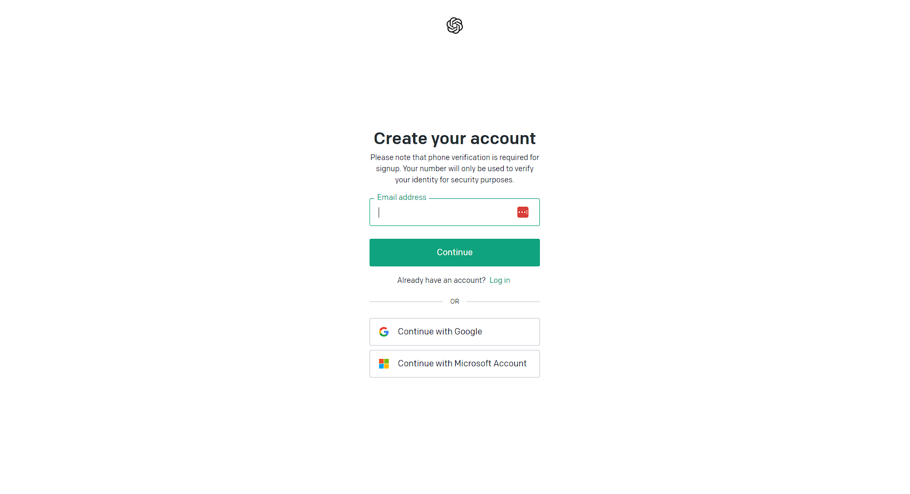
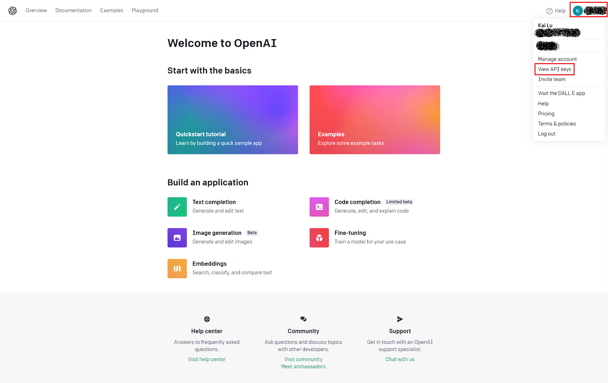
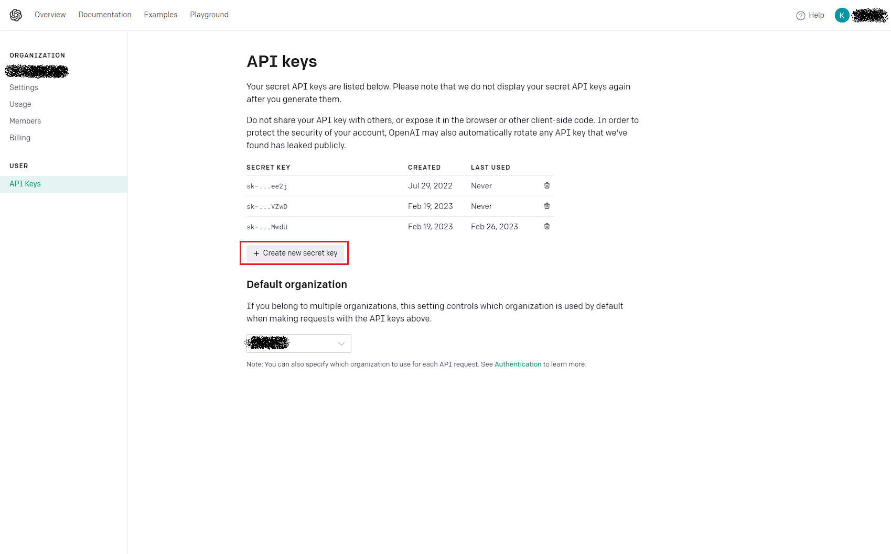
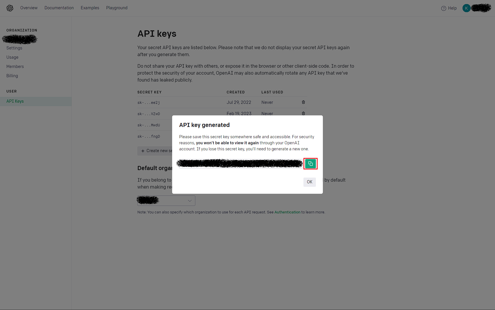
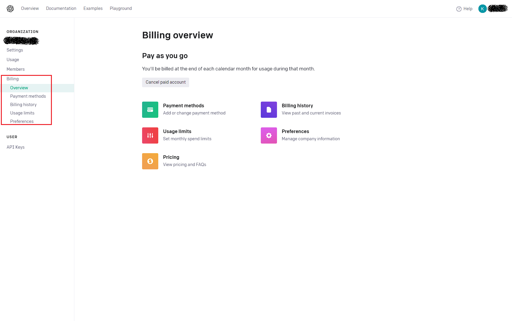

# Quickstart

0. Get npm on your machine with `sudo apt install npm`
1. `npm install`
2. `npm start`
3. Navigate to [http://localhost:3000](http://localhost:3000) to view it in the browser.
4. Get an OpenAI secret key and enter in the textbox
5. Set the parameters you want, hit generate, and be patient as it may take more than a few seconds to load the NPC

# Usage

The website can be reached at [www.npcmaker.ai](https://www.npcmaker.ai). 

The NPC Maker relies on OpenAI (both GPT3 and Dall-E 2) to generate descriptions. OpenAI access relies on your individual
OpenAI key (if you do not have an OpenAI key, and are unsure how to get one, you can follow [these instructions](#get-openai-key) to get a key). 
For security and performance reasons, this key is *never* stored on a server. Requests to OpenAI are not throttled,
but it may take a few seconds to completely generate 1 NPC. Generated NPCs can be downloaded as a JSON containing the full
information shown on screen.

There are two modes available: single target, and multi-target.

## Single Target

Single target NPC generation generates a single NPC with options for gender, race, alignment, ability score generation
method, and class/profession, as well as the ability to request a plot hook.

The name is generated using [MUNA](https://github.com/ironarachne/muna), and the weight, height, and age are generated
according to statistical methods. The remaining description is generated using GPT-3, and the portrait is generated with DALL-E.

## Multi-Target

Multi-Target NPC generation allows you to generate up to 1000 NPCs at once, following certain statistical profiles. You
can select specific gender ratios, racial diversity, and typical economic and alignment distributions of the resultant
NPCs.

The resulting generated NPCs, over a large sample size, will match the selected options (due to randomness, over a small
sample size, the resulting NPCs may not exactly match the selected profiles). 

Generating multiple NPCs make take a very large amount of time, as NPCs are generated in serial. The generation progress
will be tracked and shown.

## OpenAI Cost

NPC Maker AI uses GPT-3 Davinci, requesting a maximum of ~750-900 tokens for the description, per NPC, and 1 512*512 image
with Dall-E 2. This comes out to a price of approximately 3-4 cents (0.03 USD) per NPC.

OpenAI is free to use on a limited time/limited cost basis. After 3 months or $5, whichever comes first, users will be
required to provide payment information to continue.

### Multi-Target Cost Warning

As each NPC requires 3-4 cents, multi-target NPC generation effectively multiplies cost by the total number of NPCs
requested. Consequently, generating a high number of NPCs can rapidly increase cost (for instance, generating the 
maximum 1000 NPCs will cost over $30 USD). If you have unintentionally begun generation of a large number of NPCs,
you can exit the process by refreshing the page. Only NPCs which have been generated up to then will be charged to your
account.

# Get OpenAI Key

OpenAI accounts are free to create. Start by registering an account with OpenAI at the [registration link](https://beta.openai.com/signup/).

## Account registration

You can use Google or Microsoft SSO, or register with an email

## Visit Your Profile

Once you reach the OpenAI homepage, you can view your API keys by clicking on your profile in the top right corner, and 
selecting 'View API Keys'

## Create an API Key

Select "Create new Secret Key" to create a new secret key.

Once the popup opens, copy and save this key to a secure location! This is the key you enter to NPC Maker!

## (Optional) Add Billing Information

OpenAI is free to use for the first 3 months or first $5 USD, whichever comes first. If you want to use NPC Maker AI
to create a large number of NPCs, or for a long period of time, you may consider adding billing information. This
will cause OpenAI to charge you for the NPC Maker (this payment is not to us, and we do not take any percentage of this 
charge or request any additional payments). You can add payment methods and set billing limits in the billing tab of
OpenAI.

# Contributing

We welcome suggestions and contributions to improve our product!

## Basic Architecture

This application is a serverless React App, designed using [Plasmic](https://plasmic.app). All component designs are
located in `src/components`; files within `src/components/plasmic` are auto-generated by Plasmic and should not be
edited. 

The generation service is located in `services`; the generator itself is `services/build_npc`, which calls on other 
services in the same directory. 

`models` contains the NPC model (downloaded files will be a JSON representation of this model), and information about
how jobs are weighted in varying economic conditions.

## PR Guide

Coming soon (for now, please use your best judgment when creating new PRs!)
